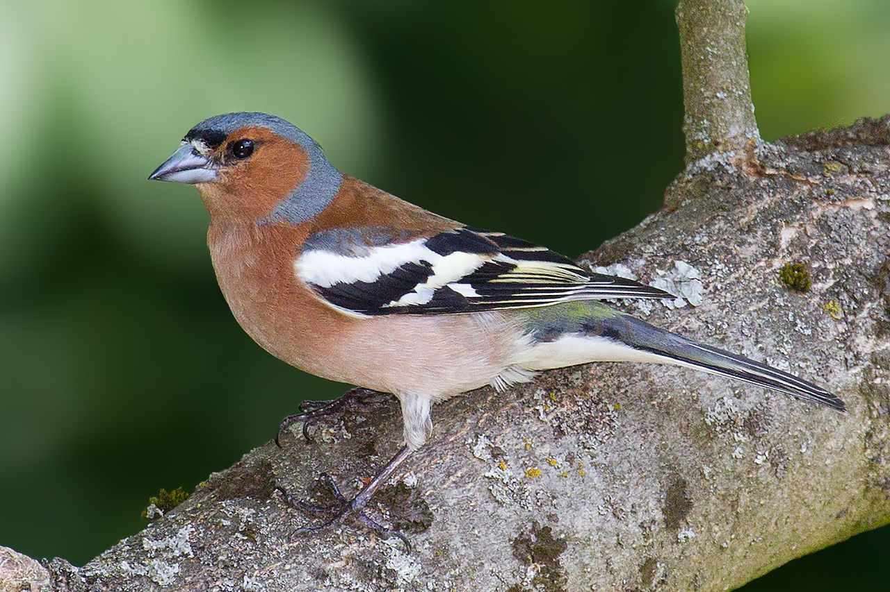

```{r setup, include=FALSE}
knitr::opts_chunk$set(echo = FALSE,
                      warning = FALSE,
                      message = FALSE,
                      fig.retina = 3)
```

```{r packages, include=FALSE}
library(tidyverse)
library(bookdown)
library(citr)
```

# Introduction
This is the introduction to chaffinches [@peterson_mountfort_hollom_wallace_2004] see figure \@ref(fig:chaffy)

(ref:chaffy) chaffinches are cute. By Photo © Andreas Trepte, CC BY-SA 3.0, https://en.wikipedia.org/wiki/Common_chaffinch#/media/File:Chaffinch_(Fringilla_coelebs).jpg

```{r chaffy, out.height="200px", fig.cap='(ref:chaffy)'}

```

# Methods
These are the methods for weighing and sexing the chaffinches.

# Results

```{r, include=FALSE}
#data import
chaff <- read_table2("raw-data/chaff.txt")

class(chaff)

```


```{r, include=FALSE}
#tidy data
chaff2<- chaff%>% 
  pivot_longer(names_to = "sex", 
               values_to = "mass",
               cols = everything())
view(chaff2)

```


```{r, include=FALSE}
#create a sum squared function
sum_sq <- function(df, measure) {
  df %>% summarise(ss = sum(({{measure}} - mean({{measure}}))^2))
}
sum_sq(chaff2, mass)
```

```{r, include=FALSE}
#adopt function to calculate SS(x) for each group
sum_sq2 <- function(df, measure, group) {
  df %>% group_by({{ group }}) %>% 
    summarise(ss = sum(({{measure}} - mean({{measure}}))^2))
}

sum_sq2(chaff2, mass, sex)
```

```{r, include=FALSE}
#summarising data
datasum <- chaff2 %>%
  group_by(sex) %>%
  summarise(mean = mean(mass),
            std = sd(mass),
            n = length(mass),
            se = std/sqrt(n))
datasum
```

```{r, include=FALSE}
#t test to determine if significant difference between males and females mass
males <- c(rnorm(20, mean = 22.3, sd = 2.15))
females <- c(rnorm(20, mean = 20.5, sd = 2.14))

t.test(males, females, paired = TRUE)

```
there was a significant difference between the masses of the two sexes p = 0.01492.

```{r myo-fig, fig.height=4, fig.width=4, fig.cap="(ref:myo-fig)"}
# making a graph
ggplot() +
  geom_point(data = chaff2, aes(x = sex, y = mass),
             position = position_jitter(width = 0.1, height = 0),
             colour = "gray50") +
  geom_errorbar(data = datasum, 
                aes(x = sex, ymin = mean - se, ymax = mean + se),
                width = 0.3) +
  geom_errorbar(data = datasum, 
                aes(x = sex, ymin = mean, ymax = mean),
                width = 0.2) +
  scale_y_continuous(name = expression("Mass / kg"), 
                     limits = c(0, 30), 
                     expand = c(0, 0)) +
  scale_x_discrete(labels = c("Male", "Female"), 
                   name = "Sex") +
  annotate("segment", x = 1, xend = 2, 
           y = 72, yend = 72,
           colour = "black") +
  annotate("segment", x = 2, xend = 2, 
           y = 72, yend = 70,
           colour = "black") +
  annotate("segment", x = 1, xend = 1, 
           y = 72, yend = 70,
           colour = "black") +
  annotate("text", x = 1.5,  y = 74, 
           label = "*", size = 8) +
  theme_classic() +
  theme(axis.title = element_text(size  = 10),
        axis.text = element_text(size = 10))
```

# Discussion


# References
